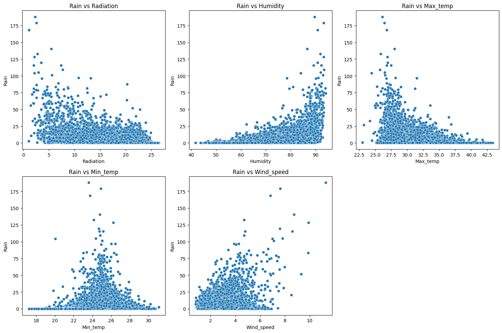
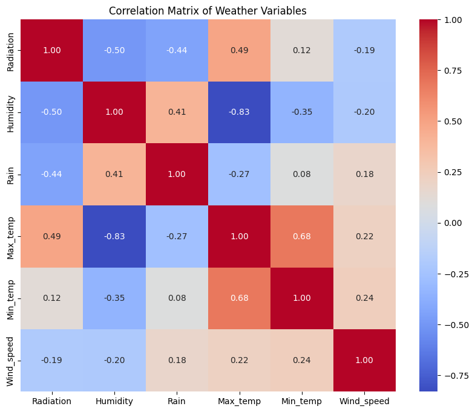

# 📊 Effects of Normalization Techniques on Linear Regression Performance

---

## 🚀 Overview

This project investigates how different **feature normalization techniques** influence the performance of Linear Regression models on real-world meteorological data.

The study evaluates whether scaling impacts prediction accuracy and explores its role in improving model stability and interpretability.

---

## 🌐 Dataset Source

The dataset used in this project was obtained from NASA's POWER (Prediction Of Worldwide Energy Resources):

👉 https://power.larc.nasa.gov/data-access-viewer/

NASA POWER provides **satellite-based weather data**, widely used in climate, agriculture, and energy research.

---

## 📊 Dataset Details

* 📍 Location: Chennai, India
* 📅 Time Period: 1984 – 2025
* 📡 Source: NASA Langley Research Center

### Features Used:

* Maximum Temperature
* Minimum Temperature
* Humidity
* Rainfall
* Wind Speed
* Solar Radiation

---

## 🎯 Objectives

* Analyze the effect of normalization on Linear Regression performance
* Compare different normalization techniques
* Evaluate impact on model accuracy and stability

---

## ⚙️ Methodology

### 🔹 Normalization Techniques

* Min-Max Scaling
* Z-score Standardization
* Robust Scaling

These techniques were applied independently, and separate models were trained for each transformed dataset.

---

## 🤖 Model Used

* Multiple Linear Regression

---

## 📊 Evaluation Metrics

* Mean Squared Error (MSE)
* Mean Absolute Error (MAE)
* R² Score
* Mallows’ Cp

---

## 📈 Results

| Metric | No Scaling | Min-Max | Standard | Robust |
| ------ | ---------- | ------- | -------- | ------ |
| R²     | 0.5347     | 0.5347  | 0.5347   | 0.5347 |
| MAE    | 0.5345     | 0.5345  | 0.5345   | 0.5345 |
| MSE    | 0.4728     | 0.4728  | 0.4728   | 0.4728 |

👉 All normalization techniques produced **identical predictive performance** 

---

## 🔍 Key Insights

* Linear Regression is **scale-invariant**
* Normalization does NOT change prediction accuracy
* Scaling improves:

  * Numerical stability
  * Coefficient interpretability
* Robust scaling handles outliers more effectively 

---

## 📊 Visual Analysis

---

## 🧠 Conclusion

Normalization does not directly impact prediction accuracy in Linear Regression.

However, it plays a critical role in:

* Improving model stability
* Enhancing interpretability
* Handling extreme values

---

## 🛠️ Tech Stack

* Python / R
* Pandas, NumPy
* Scikit-learn
* Matplotlib, Seaborn

---

## 🙌 Author

**Aditya Charan Eranki**

**Melinda Xavier** 
Vellore Institute of Technology

---

## ⭐ If you found this useful

Give this repo a ⭐

---
